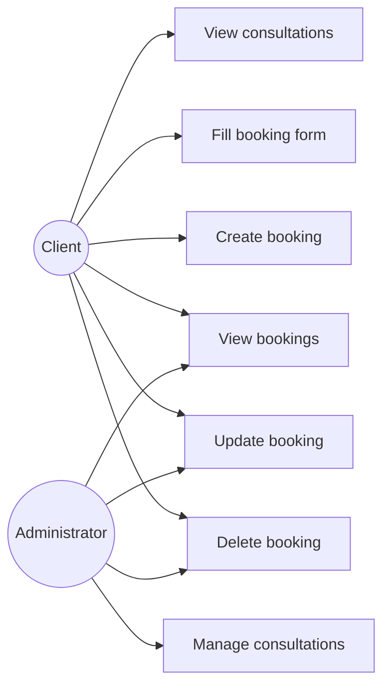

# Consultation Booking System

## Опис проєкту

**Consultation Booking System** — це адаптивний веб-застосунок для запису на консультації.  
Система дозволяє користувачу переглядати доступні консультації, створювати запис через форму, переглядати створені записи та керувати ними через простий REST API на Node.js та Express.js.

Проєкт виконано як лабораторну роботу з дисципліни, пов’язаної з web-орієнтованими технологіями та backend-розробкою.

---

## Мета проєкту

Метою проєкту є створення адаптивного веб-застосунку для запису на консультації та реалізація базової серверної частини з CRUD-операціями для записів.

---

## Опис бізнес-логіки

Система працює за такою логікою:

1. Користувач відкриває сайт і переглядає доступні консультації.
2. Користувач заповнює форму запису: ім’я, email, дату та час.
3. Дані відправляються на сервер.
4. Сервер зберігає запис у пам’яті та повертає відповідь.
5. Користувач бачить створений запис у списку на сторінці.
6. REST API дозволяє створювати, переглядати, редагувати та видаляти записи.

---

## Функціональні вимоги

- Перегляд списку доступних консультацій.
- Відображення базової інформації про кожну консультацію.
- Створення нового запису на консультацію.
- Введення імені, email, дати та часу запису.
- Збереження створених записів.
- Перегляд усіх записів.
- Редагування існуючого запису.
- Видалення запису.
- Адаптивне відображення інтерфейсу на різних пристроях.
- Підтримка адаптивної навігації з бургер-меню на малих екранах.

---

## Нефункціональні вимоги

- Простий і зрозумілий інтерфейс.
- Адаптивна верстка.
- Коректна робота в сучасних браузерах.
- Зручна структура коду для подальшої підтримки.
- Швидка відповідь сервера на запити.
- Читабельність інтерфейсу на екранах різного розміру.

---

## Ролі користувачів

### Client
- переглядає консультації;
- створює запис;
- переглядає створені записи.

### Administrator
- переглядає всі записи;
- оновлює записи;
- видаляє записи;
- керує списком консультацій.

---

## Use-Case Diagram

erDiagram
    CLIENT ||--o{ APPOINTMENT : makes
    CONSULTATION ||--o{ APPOINTMENT : includes

    CLIENT {
        int id
        string name
        string email
        string phone
    }

    CONSULTATION {
        int id
        string title
        string description
        string duration
        string availableTime
    }

    APPOINTMENT {
        int id
        int clientId
        int consultationId
        string date
        string time
        string status
    }

**Як запустити проєкт**
1.Встановити залежності:
npm install
2.Запустити сервер:
node server/server.js
3.Відкрити у браузері:
http://localhost:3000

**Висновок**

У ході виконання лабораторної роботи було розроблено адаптивний веб-застосунок для запису на консультації. Проєкт містить зручний інтерфейс, форму запису, список записів і REST API для CRUD-операцій. Під час виконання роботи було закріплено навички роботи з HTML, CSS, JavaScript, Node.js, Express.js, а також базового аналізу та моделювання системи.